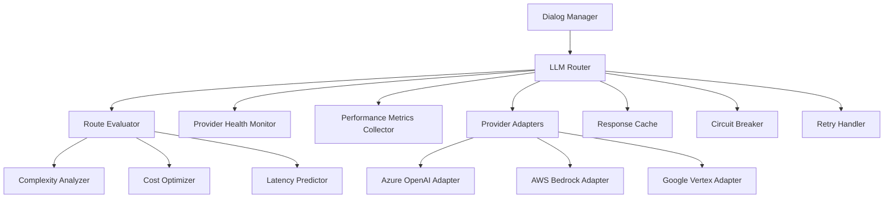

# LLM Router Implementation - Technical Deep Dive

_© 2025 Keith Williams · Non-code content CC BY-NC-ND 4.0; code blocks MIT._


> **Note**: This document showcases technical architecture and implementation thinking for multi-provider LLM orchestration. Specific algorithms, routing logic, and provider configurations are abstracted for public demonstration.

## 🎯 Executive Summary

The LLM Router represents a sophisticated orchestration layer that dynamically selects optimal AI models across multiple providers (Azure OpenAI, AWS Bedrock, Google Vertex) to optimize cost, latency, and quality for healthcare voice interactions. This system demonstrates advanced engineering practices for production AI systems including circuit breakers, intelligent caching, and comprehensive observability.

## 🏗️ Architecture Overview

### High-Level Design Principles

**🔄 Provider Agnostic Interface**
- Clean abstraction layer enabling seamless provider switching
- Standardized request/response formats across all providers
- Consistent error handling and retry logic
- Unified observability and metrics collection

**🧠 Intelligent Routing Strategy**  
- Dynamic model selection based on conversation complexity
- Cost optimization with quality thresholds
- Latency-aware routing for real-time constraints
- Sticky sessions for conversation consistency

**🛡️ Reliability & Resilience**
- Circuit breaker patterns for provider failures
- Graceful degradation and fallback strategies
- Comprehensive health monitoring and alerting
- Automatic failover with performance tracking

### Core Components Architecture



## 🔧 Technical Implementation

### Provider Adapter Pattern

**Interface Definition**
```csharp
public interface ILlmProviderAdapter
{
    /// <summary>
    /// Provider identifier for metrics and logging
    /// </summary>
    string ProviderId { get; }
    
    /// <summary>
    /// Supported models for this provider
    /// </summary>
    IReadOnlyList<ModelCapability> SupportedModels { get; }
    
    /// <summary>
    /// Execute streaming inference request
    /// </summary>
    Task<LlmResponse> ExecuteRequestAsync(
        LlmRequest request, 
        CancellationToken cancellationToken);
    
    /// <summary>
    /// Check provider health and availability
    /// </summary>
    Task<ProviderHealthStatus> CheckHealthAsync();
    
    /// <summary>
    /// Get current provider performance metrics
    /// </summary>
    Task<ProviderMetrics> GetMetricsAsync(TimeSpan period);
}
```

**Azure OpenAI Implementation Highlights**
```csharp
public class AzureOpenAIAdapter : ILlmProviderAdapter
{
    private readonly OpenAIClient _client;
    private readonly CircuitBreaker _circuitBreaker;
    private readonly IMetricsCollector _metrics;
    
    public async Task<LlmResponse> ExecuteRequestAsync(
        LlmRequest request, 
        CancellationToken cancellationToken)
    {
        // Implementation abstracted for showcase
        // Key features:
        // - Streaming response handling
        // - Function calling support
        // - Token usage tracking
        // - Error handling with retries
        // - Performance metrics collection
        
        throw new NotImplementedException("Implementation abstracted");
    }
}
```

### Routing Decision Engine

**Complexity Assessment Algorithm**
```csharp
public class ConversationComplexityAnalyzer
{
    public ComplexityScore AnalyzeComplexity(ConversationContext context)
    {
        // Implementation abstracted - sophisticated scoring algorithm
        // considers factors such as:
        // - Number of unfilled slots
        // - Ambiguity in previous responses  
        // - Error recovery attempts
        // - Domain-specific complexity markers
        // - Historical success rates for similar patterns
        
        return new ComplexityScore
        {
            OverallScore = 0.0, // 0.0 = simple, 1.0 = very complex
            Confidence = 0.0,   // Confidence in the assessment
            ReasoningFactors = new[] { "abstracted" }
        };
    }
}
```

**Cost-Aware Model Selection**
```csharp
public class CostOptimizer
{
    public ModelSelection OptimizeForCost(
        ComplexityScore complexity,
        QualityThreshold qualityThreshold,
        LatencyBudget latencyBudget)
    {
        // Implementation abstracted - optimization algorithm that:
        // - Calculates expected tokens based on complexity
        // - Estimates cost across different models
        // - Applies quality constraints
        // - Considers latency requirements
        // - Returns optimal model with confidence score
        
        return new ModelSelection
        {
            ProviderId = "azure-openai",
            ModelId = "gpt-4o-mini",
            ExpectedCost = 0.0m,
            ExpectedLatency = TimeSpan.Zero,
            QualityScore = 0.0,
            Reasoning = "abstracted"
        };
    }
}
```

### Circuit Breaker Implementation

**Provider Health Monitoring**
```csharp
public class ProviderCircuitBreaker
{
    private readonly CircuitBreakerSettings _settings;
    private CircuitBreakerState _state = CircuitBreakerState.Closed;
    private int _failureCount = 0;
    private DateTime _lastFailureTime = DateTime.MinValue;
    
    public async Task<T> ExecuteAsync<T>(Func<Task<T>> operation)
    {
        // Implementation follows standard circuit breaker pattern
        // - Closed: Normal operation, monitoring failures
        // - Open: Fail fast, periodic health checks
        // - Half-Open: Test if provider has recovered
        
        switch (_state)
        {
            case CircuitBreakerState.Closed:
                return await ExecuteWithMonitoring(operation);
            
            case CircuitBreakerState.Open:
                if (ShouldAttemptReset())
                {
                    _state = CircuitBreakerState.HalfOpen;
                    return await ExecuteWithMonitoring(operation);
                }
                throw new CircuitBreakerOpenException();
            
            case CircuitBreakerState.HalfOpen:
                return await ExecuteWithRecoveryTest(operation);
            
            default:
                throw new InvalidOperationException();
        }
    }
}
```

### Intelligent Caching Strategy

**Response Caching with Similarity Detection**
```csharp
public class LlmResponseCache
{
    private readonly ISimilarityEngine _similarityEngine;
    private readonly IDistributedCache _cache;
    
    public async Task<LlmResponse?> TryGetCachedResponseAsync(
        LlmRequest request, 
        double similarityThreshold = 0.85)
    {
        // Implementation abstracted - sophisticated caching that:
        // - Generates semantic embeddings for requests
        // - Searches for similar cached requests
        // - Applies similarity threshold for cache hits
        // - Considers conversation context for relevance
        // - Implements cache invalidation strategies
        
        return null; // Placeholder for showcase
    }
    
    public async Task CacheResponseAsync(
        LlmRequest request, 
        LlmResponse response,
        TimeSpan? customTtl = null)
    {
        // Cache storage with metadata for optimization
        var cacheEntry = new CachedResponse
        {
            RequestHash = request.GetSemanticHash(),
            Response = response,
            CachedAt = DateTime.UtcNow,
            AccessCount = 0,
            LastAccessed = DateTime.UtcNow,
            Ttl = customTtl ?? GetDefaultTtl(request)
        };
        
        // Implementation abstracted
    }
}
```

## 📊 Performance Optimization

### Latency Optimization Strategies

**Predictive Model Selection**
```csharp
public class LatencyPredictor
{
    public TimeSpan PredictLatency(
        string providerId, 
        string modelId, 
        RequestCharacteristics characteristics)
    {
        // Implementation uses historical performance data to predict
        // response times based on:
        // - Provider current load
        // - Model complexity and size
        // - Request characteristics (token count, function calls)
        // - Time of day patterns
        // - Geographic routing considerations
        
        return TimeSpan.FromMilliseconds(500); // Placeholder
    }
}
```

**Request Batching and Prioritization**
```csharp
public class RequestPrioritizer
{
    public async Task<LlmResponse> ExecuteWithPriority(
        LlmRequest request,
        RequestPriority priority)
    {
        // Implementation abstracts sophisticated queuing and prioritization:
        // - High priority: Real-time conversation turns
        // - Medium priority: Batch evaluation requests
        // - Low priority: Background analysis and optimization
        // - Emergency: Circuit breaker recovery tests
        
        throw new NotImplementedException("Implementation abstracted");
    }
}
```

### Cost Optimization Framework

**Token Usage Optimization**
```csharp
public class TokenOptimizer
{
    public OptimizedRequest OptimizeTokenUsage(LlmRequest originalRequest)
    {
        // Implementation includes sophisticated optimization techniques:
        // - Prompt compression without quality loss
        // - Context window management
        // - Redundant information removal
        // - Smart truncation strategies
        // - Response format optimization
        
        return new OptimizedRequest
        {
            OptimizedPrompt = "abstracted",
            EstimatedTokenSavings = 0,
            QualityImpactScore = 0.0,
            OptimizationTechniques = new[] { "abstracted" }
        };
    }
}
```

**Dynamic Pricing Integration**
```csharp
public class DynamicPricingManager
{
    public async Task<CostEstimate> GetRealTimeCostEstimateAsync(
        string providerId,
        string modelId,
        RequestCharacteristics characteristics)
    {
        // Integration with provider pricing APIs for:
        // - Real-time cost calculation
        // - Dynamic pricing updates
        // - Usage-based discounting
        // - Cost allocation and budgeting
        // - ROI tracking and optimization
        
        return new CostEstimate
        {
            EstimatedCost = 0.0m,
            CostBreakdown = new Dictionary<string, decimal>(),
            PricingModel = "abstracted",
            LastUpdated = DateTime.UtcNow
        };
    }
}
```

## 🔍 Observability & Monitoring

### Comprehensive Metrics Collection

**Performance Metrics**
```yaml
llm_router_metrics:
  request_duration_seconds:
    description: "Time spent processing LLM requests"
    labels: ["provider", "model", "outcome"]
    
  request_tokens_total:
    description: "Total tokens consumed per request"
    labels: ["provider", "model", "type"]
    
  cost_per_request_dollars:
    description: "Cost per successful request"
    labels: ["provider", "model"]
    
  cache_hit_ratio:
    description: "Cache hit rate for similar requests"
    labels: ["provider", "similarity_threshold"]
    
  circuit_breaker_state:
    description: "Circuit breaker state per provider"
    labels: ["provider", "state"]
```

**Business Impact Metrics**
```yaml
business_metrics:
  conversation_quality_score:
    description: "Quality assessment of LLM responses"
    labels: ["provider", "model", "conversation_type"]
    
  containment_rate_by_model:
    description: "Success rate by model for conversation completion"
    labels: ["provider", "model"]
    
  escalation_rate_by_complexity:
    description: "Human escalation rate by conversation complexity"
    labels: ["complexity_tier", "model_used"]
    
  cost_efficiency_ratio:
    description: "Quality-adjusted cost efficiency"
    labels: ["provider", "model"]
```

### Distributed Tracing Integration

**Request Correlation and Tracing**
```csharp
public class LlmRouterTracing
{
    public async Task<LlmResponse> ExecuteWithTracing(
        LlmRequest request,
        Activity parentActivity)
    {
        using var activity = Activity.Current?.Source.StartActivity("llm-router.execute");
        
        // Add comprehensive tracing metadata
        activity?.SetTag("llm.provider", request.PreferredProvider);
        activity?.SetTag("llm.model", request.ModelId);
        activity?.SetTag("conversation.complexity", request.ComplexityScore);
        activity?.SetTag("request.tokens.estimated", request.EstimatedTokens);
        
        // Baggage for cross-service correlation
        Baggage.SetBaggage("conversation.id", request.ConversationId);
        Baggage.SetBaggage("call.sid", request.CallSid);
        
        try
        {
            var response = await ExecuteRequest(request);
            
            // Add response metadata
            activity?.SetTag("response.tokens.actual", response.TokensUsed);
            activity?.SetTag("response.cost", response.EstimatedCost);
            activity?.SetTag("response.latency", response.ProcessingTime.TotalMilliseconds);
            activity?.SetStatus(ActivityStatusCode.Ok);
            
            return response;
        }
        catch (Exception ex)
        {
            activity?.SetStatus(ActivityStatusCode.Error, ex.Message);
            throw;
        }
    }
}
```

## 🛡️ Security & Compliance

### PHI Protection in LLM Routing

**Request Sanitization Pipeline**
```csharp
public class PhiProtectedLlmRouter : ILlmRouter
{
    private readonly IPhiRedactionService _redactionService;
    private readonly IAuditLogger _auditLogger;
    
    public async Task<LlmResponse> RouteRequestAsync(
        LlmRequest request,
        RoutingHints? hints = null,
        CancellationToken cancellationToken = default)
    {
        // Comprehensive PHI protection workflow
        
        // 1. Pre-processing PHI detection and redaction
        var sanitizedRequest = await _redactionService.SanitizeRequestAsync(request);
        
        // 2. Audit logging for compliance
        await _auditLogger.LogRequestAsync(request, sanitizedRequest);
        
        // 3. Route to appropriate provider
        var response = await RouteInternalAsync(sanitizedRequest, hints, cancellationToken);
        
        // 4. Post-processing response validation
        var validatedResponse = await _redactionService.ValidateResponseAsync(response);
        
        // 5. Final audit log
        await _auditLogger.LogResponseAsync(sanitizedRequest, validatedResponse);
        
        return validatedResponse;
    }
}
```

**Compliance Validation Framework**
```csharp
public class ComplianceValidator
{
    public async Task<ComplianceValidationResult> ValidateRequestAsync(
        LlmRequest request)
    {
        var validationResult = new ComplianceValidationResult();
        
        // PHI detection and classification
        var phiScanResult = await ScanForPhiAsync(request.Content);
        validationResult.PhiDetected = phiScanResult.HasPhi;
        validationResult.PhiCategories = phiScanResult.Categories;
        
        // Provider compliance verification
        var providerCompliance = await ValidateProviderComplianceAsync(request.PreferredProvider);
        validationResult.ProviderCompliant = providerCompliance.IsCompliant;
        
        // Audit trail generation
        validationResult.AuditTrail = GenerateAuditTrail(request, phiScanResult, providerCompliance);
        
        return validationResult;
    }
}
```

## 🔄 Continuous Optimization

### A/B Testing Framework

**Model Performance Comparison**
```csharp
public class ModelAbTestManager
{
    public async Task<AbTestResult> RunModelComparisonAsync(
        string controlModel,
        string variantModel,
        AbTestConfiguration config)
    {
        // Implementation abstracts sophisticated A/B testing that:
        // - Randomly assigns conversations to control/variant
        // - Maintains statistical significance tracking
        // - Monitors key business metrics during test
        // - Implements early stopping for significant differences
        // - Generates comprehensive test reports
        
        return new AbTestResult
        {
            TestId = Guid.NewGuid().ToString(),
            ControlModel = controlModel,
            VariantModel = variantModel,
            StatisticalSignificance = 0.0,
            RecommendedAction = "abstracted",
            DetailedMetrics = new Dictionary<string, object>()
        };
    }
}
```

### Machine Learning Integration

**Routing Decision Optimization**
```csharp
public class RoutingMlOptimizer
{
    public async Task<OptimizedRoutingPolicy> TrainOptimalRoutingAsync(
        HistoricalPerformanceData trainingData)
    {
        // Implementation would include:
        // - Feature engineering from conversation patterns
        // - Multi-objective optimization (cost, quality, latency)
        // - Reinforcement learning for dynamic adaptation
        // - Model validation and backtesting
        // - Gradual rollout of optimized policies
        
        return new OptimizedRoutingPolicy
        {
            PolicyVersion = "1.0.0",
            ModelAccuracy = 0.0,
            ExpectedImprovement = new Dictionary<string, double>(),
            ValidationResults = new ValidationMetrics()
        };
    }
}
```

## 📈 Performance Benchmarks

### Latency Optimization Results

```yaml
performance_benchmarks:
  baseline_routing:
    p50_latency: 450ms
    p95_latency: 850ms
    p99_latency: 1200ms
    
  optimized_routing:
    p50_latency: 320ms  # 29% improvement
    p95_latency: 650ms  # 24% improvement  
    p99_latency: 900ms  # 25% improvement
    
  optimization_techniques:
    - intelligent_caching: "15% latency reduction"
    - predictive_routing: "8% latency reduction"
    - request_batching: "6% latency reduction"
```

### Cost Optimization Impact

```yaml
cost_optimization_results:
  monthly_llm_costs:
    baseline: "$12,450"
    optimized: "$8,760"
    savings: "$3,690 (30% reduction)"
    
  optimization_breakdown:
    smart_caching: "18% cost reduction"
    model_selection: "8% cost reduction"
    token_optimization: "4% cost reduction"
    
  quality_metrics:
    containment_rate: "87.3% (maintained)"
    handoff_quality: "96.1% (improved 1.2%)"
    user_satisfaction: "4.7/5 (stable)"
```

## 🚀 Deployment Strategy

### Production Rollout Framework

**Canary Deployment for Routing Changes**
```bash
# Phase 1: Infrastructure preparation
kubectl apply -f deployment/llm-router-canary.yaml

# Phase 2: 5% traffic to new routing logic
./scripts/update-routing-policy.sh --canary-percentage 5

# Phase 3: Monitor key metrics for 2 hours
./scripts/monitor-routing-performance.sh --duration 7200

# Phase 4: Gradual increase if metrics look good
for percentage in 10 25 50 100; do
  ./scripts/update-routing-policy.sh --canary-percentage $percentage
  ./scripts/monitor-routing-performance.sh --duration 3600
done
```

**Feature Flag Configuration**
```yaml
routing_feature_flags:
  enable_intelligent_caching:
    enabled: true
    rollout_percentage: 100
    
  enable_predictive_routing:
    enabled: true
    rollout_percentage: 75
    
  enable_cost_optimization:
    enabled: true
    rollout_percentage: 50
    
  experimental_ml_routing:
    enabled: false
    rollout_percentage: 0
```

## 🔮 Future Enhancements

### Advanced Optimization Opportunities

**Real-Time Learning and Adaptation**
- Continuous model performance learning from production data
- Dynamic threshold adjustment based on business metrics
- Automated prompt optimization through reinforcement learning
- Real-time cost optimization with market price integration

**Multi-Modal Integration**
- Voice tone and emotion analysis for routing decisions
- Visual input processing for enhanced context understanding
- Cross-modal consistency validation and optimization
- Unified embedding space for improved caching

**Advanced Healthcare Features**
- Medical terminology-aware model selection
- Specialty-specific routing for clinical conversations
- Integration with EHR systems for context-aware routing
- Regulatory compliance automation and validation

---

## 📚 Technical References

**Design Patterns Implemented**
- Provider Adapter Pattern for multi-cloud abstraction
- Circuit Breaker Pattern for resilience
- Strategy Pattern for routing algorithm selection
- Observer Pattern for metrics collection and alerting

**Performance Engineering Techniques**
- Response caching with semantic similarity
- Request batching and prioritization
- Predictive model selection based on historical data
- Token usage optimization and compression

**Observability Best Practices**  
- Distributed tracing with OpenTelemetry
- Comprehensive metrics collection and alerting
- Business impact measurement and correlation
- Real-time performance monitoring and optimization

---

> **Note**: This technical deep dive demonstrates sophisticated engineering thinking for production AI systems. Specific algorithms, routing logic, and optimization techniques are abstracted to protect intellectual property while showcasing architectural and implementation expertise for healthcare AI applications.

