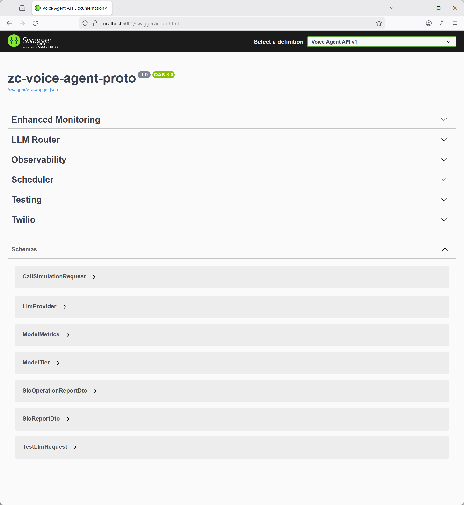
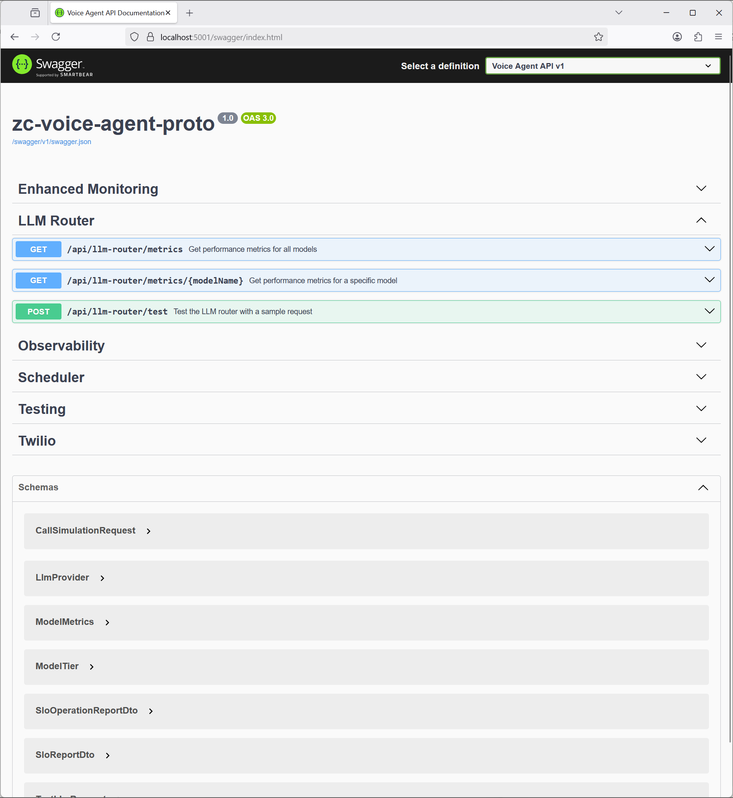
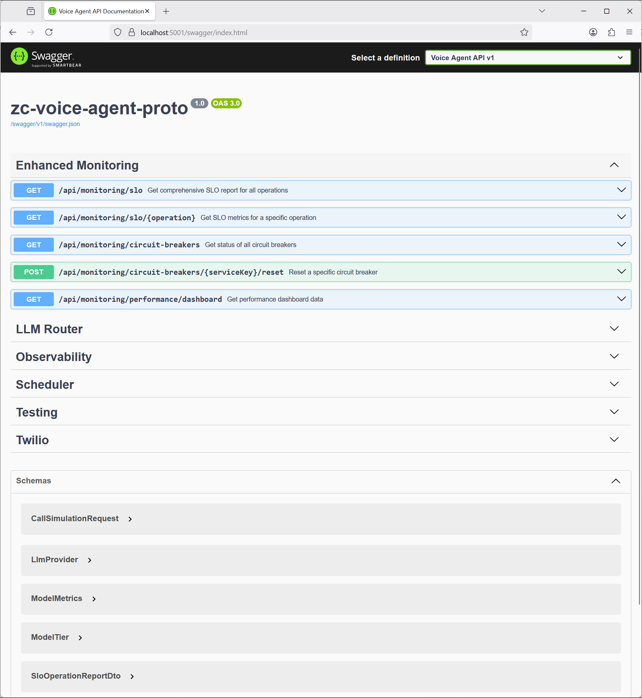

# Healthcare Voice AI Assistant — Architecture Showcase

> This is a public work sample showcasing system architecture and engineering approach.
> Implementation details and production configurations are intentionally excluded.
> No PHI. Not a compliance claim.

**Licensing**
- **Code:** MIT (see `LICENSE-CODE`).
- **Docs/diagrams/screenshots/GIFs:** CC BY-NC-ND 4.0 (see `LICENSE-DOCS`).
- Code blocks within README are considered **code** (MIT). Non-code prose/images are **content** (CC BY-NC-ND).

**Scope**
- Includes: architecture (C4), ADRs, screenshots/GIF of the evaluation harness, limited illustrative code.
- Excludes: runnable telephony hooks, prompts, evaluation datasets with real data, deployment/production configurations.

A **production-minded** architecture for a healthcare phone AI assistant (prototype) demonstrating staff-level engineering for real-time voice AI systems. Built with reliability, observability, and PHI hygiene as core principles.


## 🎯 Why This Project Exists

Demonstrate comprehensive engineering skills for complex voice AI systems:
- **Real-time constraints**: Sub-700ms turn latency budgets
- **Production reliability**: Safe deployments, observability, incident response
- **Healthcare compliance**: PHI protection, audit trails, consent management
- **Evaluation-driven**: Tight feedback loops with measurable outcomes

## 🏗️ System Architecture

```
┌─────────────┐    HTTPS     ┌──────────────────┐   streaming   ┌─────────────┐
│   Caller    │ ────────────▶ │ ASP.NET Core API │ ─────────────▶ │ LLM Router  │
└─────────────┘   Twilio     └──────────────────┘               └─────────────┘
      ▲               │              │  structured                ┌─────────────┐
      │       media/DTMF             └──────────────────────────▶ │ Scheduler   │
      └───────────────┘              traces/logs/metrics         │     API     │
                                                                  └─────────────┘
```

### Key Design Principles

**🔧 Reliability First**
- Circuit breakers with exponential backoff for LLM calls
- Graceful degradation when providers are unavailable
- Blue-green deployments with canary traffic routing
- Comprehensive health checks and SLO monitoring

**🔍 Production Observability**
- End-to-end trace propagation across all services
- Structured logging with PHI redaction at source
- Real-time metrics for latency, containment rate, handoff quality
- Custom dashboards for business and technical metrics

**🛡️ Healthcare Security**
- Minimum-necessary PHI capture with configurable retention
- Input/output redaction pipeline for logs and metrics
- Signed request validation and rate limiting
- HIPAA-compliant audit trails

**🧪 Evaluation-Driven Development**
- Automated dialog replay testing for regression detection
- Multi-dimensional metrics (containment, quality, latency, cost)
- A/B testing framework for prompt and model optimization
- PHI leak detection and prevention validation

## 🎬 System in Action

### API Overview
The system exposes a comprehensive REST API for voice processing, LLM routing, and monitoring:



### LLM Router & Monitoring  



### Evaluation Framework in Action


*The system is fully functional locally with minimal setup - see Getting Started section below.*

## 🎤 Core User Journey

1. **Answer & Consent**: HIPAA-compliant greeting with recording disclosure
2. **Intent Classification**: Route to book/confirm/cancel/transfer workflows  
3. **Slot Filling**: Structured data collection with validation
   - Patient name or callback number
   - Date of birth (configurable for verification vs callback)
   - Provider/specialty preference
   - Insurance information (normalized downstream)
4. **Guardrails**: Profanity filtering, turn limits, safe fallbacks
5. **Handoff**: Structured payload delivery to scheduling system
6. **Post-Call**: Redacted transcript storage for evaluation

## 🤖 LLM Router Architecture

Provider-agnostic routing system optimizing for cost, latency, and quality:

**Smart Model Selection**
- Default: GPT-4o mini for fast, cost-effective interactions
- Promotion: GPT-4o or Claude for complex/ambiguous conversations  
- Fallback: Multiple providers for redundancy (Azure, AWS, GCP)

**Routing Logic**
```
Model Selection Pipeline:
├── Confidence Assessment ──▶ Low confidence? Promote to premium model
├── Complexity Analysis ────▶ High complexity? Route to specialized model  
├── Latency Budget ─────────▶ Budget exceeded? Use fastest available
└── Stickiness ─────────────▶ Stay on same model for conversation
```

**Performance Optimization**
- Per-model metrics tracking (latency, quality, cost)
- Dynamic threshold adjustment based on historical performance
- Request/response caching for common interaction patterns
- Token usage optimization and cost monitoring

## 📊 Evaluation Framework

Comprehensive testing harness for measuring system performance:

### Key Metrics
- **Containment Rate**: % calls resolved without human transfer (target: >85%)
- **Handoff Quality**: % successful scheduler integrations (target: >95%)  
- **Turn Efficiency**: Average turns to successful completion
- **Latency Breakdown**: P50/P95/P99 for each system hop
- **Cost per Interaction**: Token usage and provider costs
- **PHI Compliance**: Zero tolerance for data leaks

### Testing Methodology
```bash
# Automated dialog replay testing
./eval/scripts/run-call-sims.sh

# Generates comprehensive reports:
# - Per-scenario success rates  
# - Latency heat maps
# - Cost trend analysis
# - Regression detection
# - PHI leak validation
```

## 🛠️ Technology Stack

**Core Platform**
- **Runtime**: .NET 8 with ASP.NET Core minimal APIs
- **Telephony**: Twilio Voice (pluggable architecture for other providers)
- **LLM Integration**: Multi-provider adapter (Azure OpenAI, AWS Bedrock, GCP Vertex)
- **Observability**: OpenTelemetry with Prometheus/Grafana
- **Storage**: SQLite for local development, configurable for production

**Production Infrastructure**  
- **Deployment**: Docker containers with Kubernetes orchestration
- **Load Balancing**: Cloud-native load balancers with health checks
- **Monitoring**: Full-stack observability with alerting
- **Security**: WAF, DDoS protection, network isolation

## 🚀 Getting Started (Development)

```bash
# Prerequisites: .NET 8 SDK, Twilio account, LLM provider API keys

# Clone and setup
git clone [repository-url]
cd voice-agent-work-sample
dotnet restore

# Configure environment
cp .env.example .env
# Edit .env with your API keys and configuration

# Run locally
dotnet run

# Expose with ngrok for Twilio webhook
ngrok http 5000
# Configure Twilio webhook: POST https://your-ngrok-url/twilio/voice

# Run evaluation suite
./eval/scripts/run-tests.sh
```

## 📋 Production Operations

**Deployment Strategy**
- Blue-green deployments with gradual traffic shifting
- Feature flags for safe prompt and model changes
- Automated rollback on SLO breach detection
- Canary releases for new LLM models

**Monitoring & Alerting**
- Real-time SLO dashboards with error budget tracking
- PagerDuty integration for critical alerts
- Slack notifications for warnings and trends
- Custom business metrics for stakeholder reporting

**Security & Compliance**
- PHI redaction pipeline with audit logging
- API key rotation with zero-downtime updates
- Regular vulnerability scanning and patching
- HIPAA compliance validation and reporting

## 📈 Roadmap & Future Enhancements

**Near Term**
- Real-time ASR/TTS streaming with barge-in support
- Insurance plan normalization service with caching
- Multi-tenant configuration for practice-specific workflows

**Medium Term**  
- Advanced prompt engineering with automated A/B testing
- Voice emotion detection for escalation routing
- Integration with major EHR systems (Epic, Cerner)

**Long Term**
- Multi-modal AI support (text, voice, potentially visual)
- Predictive analytics for appointment scheduling optimization
- Advanced conversation analytics and coaching insights

## 🎓 Engineering Showcase

This project demonstrates:

**System Design**
- Microservices architecture with clear service boundaries
- Event-driven patterns with comprehensive error handling
- Scalable, cloud-native deployment strategies

**Software Engineering**
- Clean code principles with SOLID design patterns
- Comprehensive test coverage (unit, integration, end-to-end)
- CI/CD pipelines with automated quality gates

**Production Operations**
- SRE principles with SLO-driven development
- Comprehensive monitoring and alerting strategies
- Incident response procedures and runbooks

**Healthcare Domain Expertise**
- HIPAA compliance and PHI protection strategies
- Healthcare workflow integration patterns
- Patient-centric UX design principles

---

**📞 Questions?** This showcase represents production-ready architecture thinking while maintaining proprietary implementation details. The focus is on demonstrating engineering maturity and system design capabilities for complex, real-time healthcare applications.

---

## License

MIT License - This work sample is provided for demonstration purposes.