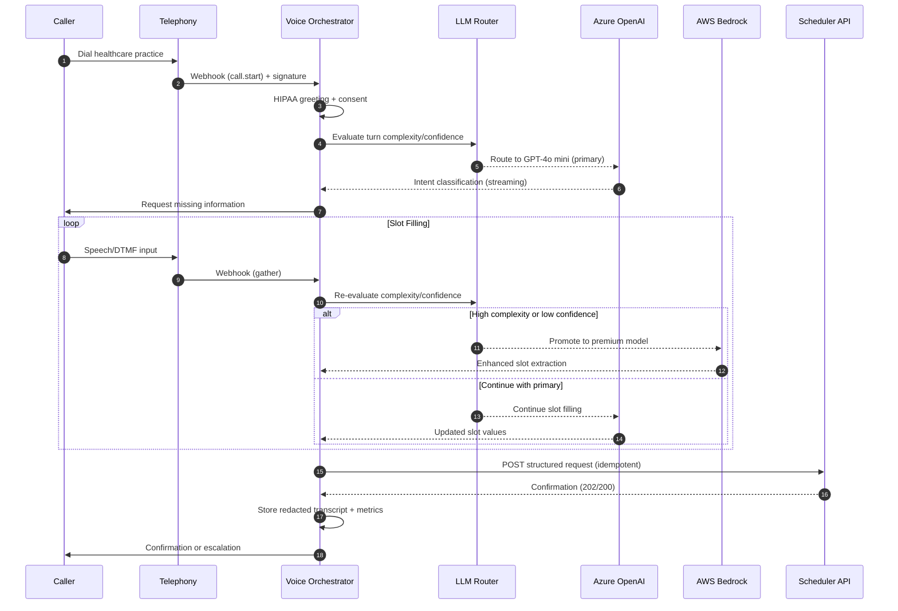

# Voice AI Assistant - C4 Architecture & Design Decisions

_© 2025 Keith Williams · Non-code content CC BY-NC-ND 4.0; code blocks MIT._

> **Note**: This document showcases architectural thinking and decision-making process. Implementation details are abstracted for public demonstration.

This document captures the C4 model (Context → Container → Component) for the voice assistant system, plus lightweight Architecture Decision Records (ADRs) demonstrating systematic design thinking.

---

## C1 — System Context

**Primary Purpose**: Handle inbound healthcare calls for scheduling-related intents, gather required patient information, and hand off to scheduling systems with strong reliability, observability, and PHI protection.

**Primary Users**: 
- **Patients/Callers**: Primary interaction via phone calls
- **Clinic Staff**: Secondary users for escalations and handoffs

**External Systems**:
- **Telephony Provider** (Twilio): Call ingress, media/DTMF, webhook delivery
- **LLM Providers** (Azure OpenAI, AWS Bedrock, Google Vertex): Streaming inference with dynamic routing
- **Scheduler System**: Receives structured appointment requests
- **Observability Stack** (OTLP collector + monitoring): Comprehensive traces/metrics/logs

**The System**: Voice Assistant System — orchestrates dialog flow, enforces guardrails, routes LLM requests, manages handoffs, and enables evaluation.

---

## C2 — Container View

**Core Containers**:

**🎯 Voice Orchestrator API** (ASP.NET Core, .NET 8)
- Twilio webhook endpoint with signature validation
- Dialog state machine with intent classification
- **LLM Router** with provider-agnostic abstraction
- PHI redaction pipeline and audit logging
- Idempotent scheduler client with retry logic
- Comprehensive telemetry and feature flags

**📊 Transcript/Evaluation Store** (SQLite + Files)
- Redacted transcript persistence
- Evaluation metrics and test results
- Audit trail for compliance

**🧪 Evaluation Harness** (CLI/Scripts)
- Automated dialog replay testing
- Performance metrics generation
- Regression detection and reporting

**External Containers**:
- **Telephony Provider**: Webhook delivery and media handling
- **LLM Providers**: Multi-provider AI inference (Azure/AWS/GCP)  
- **Scheduler API**: Appointment booking system integration
- **OTLP Collector**: Observability data aggregation

---

## C3 — Component View (Voice Orchestrator API)

**Core Components**:

**🌐 TwilioWebhookController**
- Signature validation and security
- Turn orchestration and timeout management
- DTMF and speech input handling

**🤖 DialogManager**
- Intent detection and classification
- Slot-filling state machine
- Turn limits and escalation policies
- Business logic enforcement

**📝 PromptTemplateManager**
- Versioned prompt templates
- Feature-flagged prompt variants
- A/B testing support

**🧠 LlmRouter**
- Per-turn model selection and promotion
- Provider adapter pattern (Azure/Bedrock/Vertex)
- Stickiness policy per conversation
- Latency and quality optimization

**🔌 LlmClientAdapters**
- Provider-specific implementations
- Streaming and function-calling support
- Circuit breaker patterns

**🛡️ RedactionFilter**
- PHI/PII masking at log boundaries
- Transcript sanitization
- Compliance audit support

**📋 SchedulerClient**
- Normalized payload generation
- Idempotency and deduplication
- Retry logic with exponential backoff

**💾 StateStore**
- Per-call ephemeral state management
- Transcript assembly and validation
- Session context preservation

**📊 Telemetry**
- OpenTelemetry integration
- Trace and baggage propagation
- Custom business metrics

**🎛️ FeatureFlags**
- Runtime feature gating
- Canary releases and rollbacks
- A/B testing infrastructure

**📋 ConsentManager**
- HIPAA-compliant greetings
- Recording disclosure management
- Consent policy routing

---

## Dynamic View — Call Flow Sequence

---

## Quality Attributes & SLOs

**⚡ Performance**
- **Target**: <700ms P95 per LLM turn for primary model
- **Promotion Policy**: Allow brief budget exceedance for quality improvements
- **Overall Goal**: <2.5s P95 per complete user interaction

**💰 Cost Optimization**
- Track average per-call LLM costs and token efficiency
- Monitor tokens per successful handoff
- Dynamic routing to optimize cost/quality tradeoffs

**🔒 Reliability**
- Graceful degradation during provider outages
- Idempotent operations with retry/backoff
- Sticky model selection per conversation
- Circuit breaker patterns for external dependencies

**🛡️ Security & PHI Protection**
- Minimum necessary data collection principle
- Redaction at all log ingestion points
- Configurable consent and retention windows
- HIPAA-compliant provider selection

**👁️ Observability**
- Per-model performance metrics
- Containment rate monitoring (target: >85%)
- Handoff quality assessment (target: >95%)
- Latency breakdown analysis (P50/P95/P99)
- PHI leak detection and prevention

---

## Architecture Decision Records (ADRs)

### ADR-001 — Telephony Integration Strategy

**Status**: ✅ Accepted

**Context**: Need reliable call ingress without infrastructure complexity

**Decision**: Implement Twilio Programmable Voice with webhook validation

**Consequences**: 
- ✅ Rapid prototype development
- ✅ Proven reliability and scale
- ⚠️ Vendor coupling (mitigated by abstraction layer)
- ✅ Strong developer experience and documentation

### ADR-002 — Runtime Platform Selection

**Status**: ✅ Accepted

**Context**: Performance, developer productivity, and ecosystem requirements

**Decision**: ASP.NET Core minimal APIs on .NET 8

**Consequences**:
- ✅ High performance and low latency
- ✅ Excellent tooling and debugging experience
- ✅ Native OpenTelemetry integration
- ✅ Strong healthcare compliance ecosystem

### ADR-003 — Multi-Provider LLM Architecture

**Status**: ✅ Accepted

**Context**: Avoid vendor lock-in while supporting diverse model capabilities

**Decision**: Provider-agnostic adapter pattern with streaming + function calling

**Consequences**:
- ✅ Flexibility to optimize cost/performance/quality
- ✅ Resilience against provider outages
- ✅ Consistent evaluation framework across models
- ⚠️ Additional abstraction complexity

### ADR-004 — PHI Protection Strategy

**Status**: ✅ Accepted

**Context**: Healthcare compliance requirements for data handling

**Decision**: Redaction-at-boundary pattern for all logs and metrics

**Consequences**:
- ✅ Reduced compliance risk and operational exposure
- ✅ Clear audit trails for regulatory review
- ⚠️ Additional development and testing overhead
- ✅ Demonstrates security-first thinking

### ADR-005 — Observability Architecture

**Status**: ✅ Accepted

**Context**: Need comprehensive visibility across distributed system

**Decision**: OpenTelemetry with standardized trace propagation

**Consequences**:
- ✅ End-to-end request tracing capabilities
- ✅ Vendor-neutral observability stack
- ✅ Rich business and technical metrics
- ⚠️ Collector infrastructure requirements

### ADR-006 — Idempotency Design

**Status**: ✅ Accepted

**Context**: Network reliability and webhook retry patterns

**Decision**: Deterministic idempotency keys with server-side deduplication

**Consequences**:
- ✅ Prevents duplicate appointments and data corruption
- ✅ Resilient to network failures and retries
- ⚠️ Requires careful key design and server support

### ADR-007 — Feature Flag Architecture

**Status**: ✅ Accepted

**Context**: Safe deployment of prompt and model changes

**Decision**: Runtime feature flags with canary release capabilities

**Consequences**:
- ✅ Safe iteration on production systems
- ✅ Quick rollback capabilities
- ✅ A/B testing infrastructure
- ⚠️ Additional configuration management complexity

### ADR-008 — Development Data Strategy

**Status**: ✅ Accepted (Prototype Phase)

**Context**: Simple development and evaluation needs

**Decision**: SQLite + filesystem for redacted transcripts and metrics

**Consequences**:
- ✅ Fast development iteration
- ✅ Zero external dependencies for development
- ⚠️ Requires migration path for production scale
- ✅ Clear data model for future system design

### ADR-009 — Evaluation Framework Design

**Status**: ✅ Accepted

**Context**: Need quantitative assessment of system improvements

**Decision**: Automated dialog replay with comprehensive metrics

**Consequences**:
- ✅ Objective measurement of system performance
- ✅ Regression detection for prompt/model changes
- ✅ Data-driven optimization decisions
- ⚠️ Requires test dataset curation and maintenance

### ADR-010 — LLM Routing Policy

**Status**: ✅ Accepted

**Context**: Optimize cost/latency/quality tradeoffs dynamically

**Decision**: Smart routing with promotion thresholds and call stickiness

**Consequences**:
- ✅ Cost optimization without sacrificing quality
- ✅ Consistent conversation experience
- ✅ Performance-based model selection
- ⚠️ Complex threshold tuning and monitoring requirements

---

## Future Considerations

**🔄 Potential Future ADRs**:
- Real-time ASR/TTS streaming architecture
- Multi-tenant configuration and customization
- Advanced prompt engineering and optimization
- Integration patterns for major EHR systems
- Advanced analytics and conversation insights

**🎯 Open Technical Questions**:
- Optimal barge-in detection and handling strategies  
- Insurance plan normalization and caching approaches
- Advanced conversation analytics and coaching features
- Multi-modal interaction support (voice + text + visual)

---

## Architectural Principles Demonstrated

**🏗️ System Design Excellence**
- Clean service boundaries with well-defined interfaces
- Event-driven patterns with comprehensive error handling  
- Cloud-native scalability and resilience patterns

**⚙️ Software Engineering Maturity**
- SOLID principles with dependency injection
- Comprehensive testing strategies (unit/integration/E2E)
- CI/CD with automated quality gates

**🔧 Production Operations**
- SRE principles with SLO-driven development
- Comprehensive monitoring and alerting
- Incident response and operational runbooks

**🏥 Healthcare Domain Expertise**
- HIPAA compliance and PHI protection
- Healthcare workflow integration patterns
- Patient-centric user experience design

---

**📚 Glossary**:
- **Containment Rate**: Percentage of calls resolved without human handoff
- **Handoff Quality**: Completeness and accuracy of transferred information
- **PHI**: Protected Health Information subject to HIPAA regulations
- **Sticky Model**: Routing policy maintaining model consistency per conversation
- **Barge-in**: Caller interruption during system speech output

