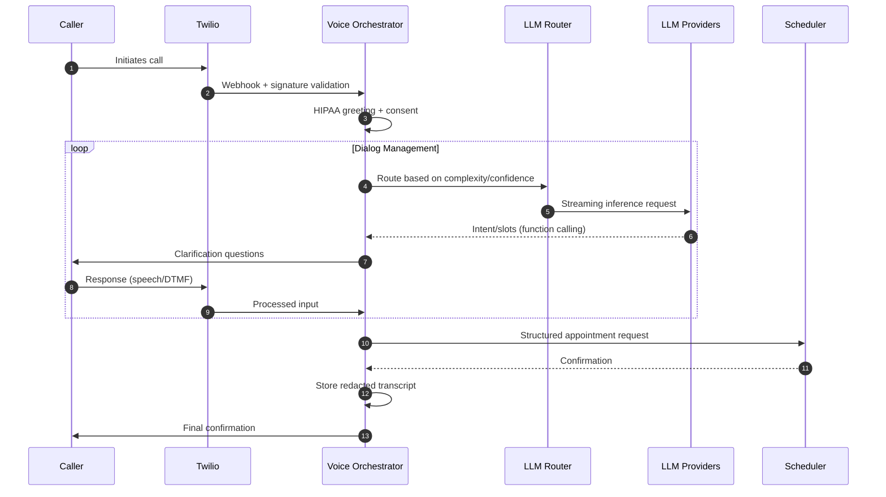

# Architecture Diagrams

This directory contains the visual architecture documentation for the Voice AI Assistant system.

## C4 Model Diagrams

### Generating Diagrams

The `voice-agent-c4.dsl` file contains the complete C4 model definition using Structurizr DSL syntax. To generate the actual diagram images:

1. **Option 1: Structurizr Lite (Recommended)**
   ```bash
   # Run local Structurizr Lite server
   docker run -it --rm -p 8080:8080 -v $(pwd):/usr/local/structurizr structurizr/lite
   
   # Open http://localhost:8080 and upload voice-agent-c4.dsl
   ```

2. **Option 2: Structurizr CLI**
   ```bash
   # Export to PlantUML format
   java -jar structurizr-cli.jar export -workspace voice-agent-c4.dsl -format plantuml
   
   # Then render with PlantUML
   plantuml *.puml
   ```

3. **Option 3: Online Structurizr**
   - Visit [structurizr.com](https://structurizr.com)
   - Create a new workspace
   - Copy/paste the DSL content
   - Generate diagrams online

### Available Views

The DSL generates four key architectural views:

1. **System Landscape**: High-level view showing all systems and actors
2. **System Context (C1)**: Focus on the Voice Assistant System and its external dependencies
3. **Container View (C2)**: Internal containers within the Voice Assistant System
4. **Component View (C3)**: Detailed component breakdown of the Voice Orchestrator API

### Architectural Highlights

**🔧 Component Design Patterns**
- Clean separation of concerns with single responsibility components
- Provider adapter pattern for LLM integration
- Pipeline pattern for request processing and PHI redaction
- State machine pattern for dialog management

**🔄 Data Flow Patterns**
- Request/response flow with comprehensive error handling
- Event-driven architecture with webhook processing
- Streaming data processing for real-time interactions
- Audit trail generation for compliance

**🛡️ Security Architecture**
- PHI redaction at system boundaries
- Signature validation for all external requests
- Secure credential management and rotation
- Network isolation and encryption in transit

**📊 Observability Integration**
- Distributed tracing across all components
- Business and technical metrics collection
- Structured logging with correlation IDs
- Real-time monitoring and alerting

## Call Flow Sequence



## Architecture Decision Documentation

See the main `architecture.md` file for detailed ADRs explaining key design decisions including:

- Telephony integration strategy
- Multi-provider LLM architecture  
- PHI protection and compliance approach
- Observability and monitoring design
- Idempotency and reliability patterns

## Design Principles Demonstrated

**🏗️ System Architecture**
- Microservices with clear boundaries
- Cloud-native deployment patterns
- Horizontal scalability design
- Resilience and fault tolerance

**⚙️ Software Engineering**
- SOLID principles and clean code
- Dependency injection and testability
- Configuration-driven behavior
- Comprehensive error handling

**🔧 Production Operations**
- Infrastructure as code approach
- Automated deployment pipelines
- Comprehensive monitoring and alerting
- Incident response and recovery

**🏥 Healthcare Compliance**
- HIPAA-aware system design
- PHI protection at every layer
- Audit trail and compliance reporting
- Secure development practices

---

> **Note**: This showcase demonstrates architectural thinking and system design capabilities. Actual implementation details and proprietary business logic are abstracted for public demonstration purposes.
